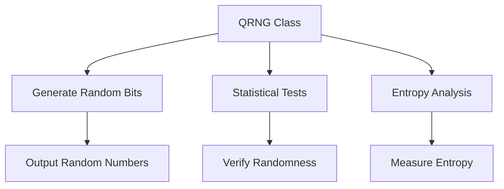

# Technical Implementation

## System Architecture

The following diagram illustrates the core components of the QRNG system and their interactions:



### Component Breakdown

1. **QRNG Class (A)**
   - The main controller class that orchestrates the random number generation process
   - Implements the quantum-inspired algorithm and manages the state
   - Provides a clean API for generating random numbers

2. **Generate Random Bits (B)**
   - Core random bit generation using quantum-inspired algorithms
   - Supports multiple algorithms (Mersenne Twister, Xoshiro, PCG, Quantum Simulated)
   - Configurable number of qubits and measurement shots

3. **Statistical Tests (C)**
   - Validates the quality of generated random numbers
   - Implements standard tests:
     - Frequency (Monobit) Test
     - Runs Test
     - Chi-Square Test

4. **Entropy Analysis (D)**
   - Measures the quality of randomness
   - Calculates:
     - Shannon Entropy (information density)
     - Min-Entropy (worst-case predictability)

5. **Output Random Numbers (E)**
   - Final output of the random bit stream
   - Can be used directly or further processed
   - Includes statistical metadata

6. **Verify Randomness (F)**
   - Ensures generated numbers meet statistical requirements
   - Validates p-values against significance level (α = 0.05)
   - Provides pass/fail status for quality control

7. **Measure Entropy (G)**
   - Quantifies the randomness quality
   - Used for performance benchmarking
   - Helps in algorithm comparison and selection

## Key Components

### 1. Random Bit Generation
- Uses quantum-inspired algorithms
- Configurable number of qubits and shots
- High-performance implementation using modern C++

### 2. Statistical Tests
- Frequency (Monobit) Test
- Runs Test
- Chi-Square Test

### 3. Entropy Analysis
- Shannon Entropy
- Min-Entropy

## Performance
- Generates millions of bits per second
- Low memory footprint
- Thread-safe implementation

## Dependencies
- C++17 or later
- Qt6 Core module
- CMake 3.10+

## Build Instructions
```bash
mkdir build && cd build
cmake ..
make
```

[Next: View testing methodology →](TESTING_METHODOLOGY.md)
